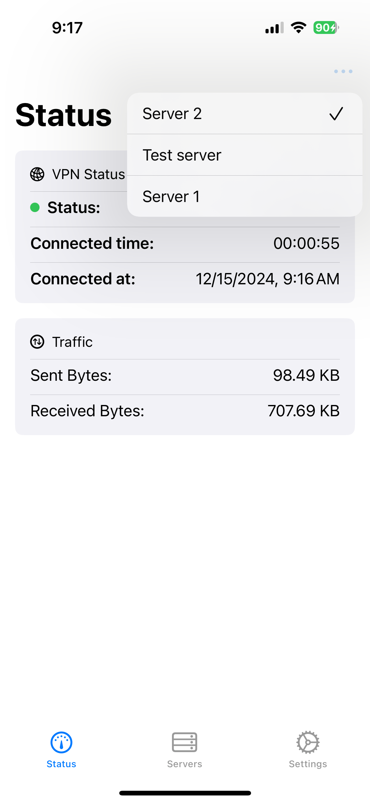
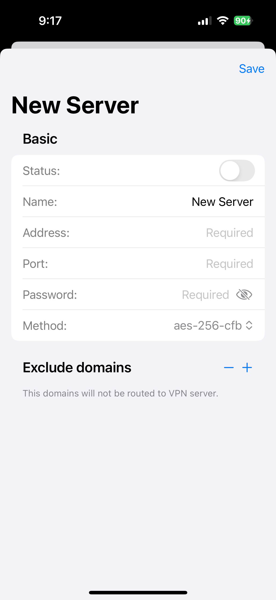
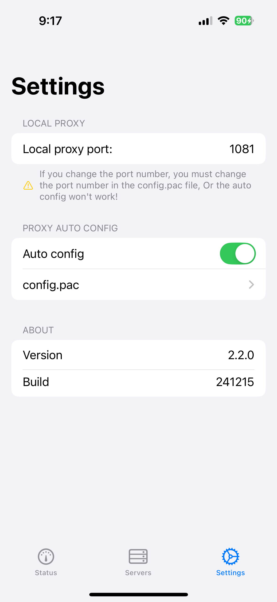
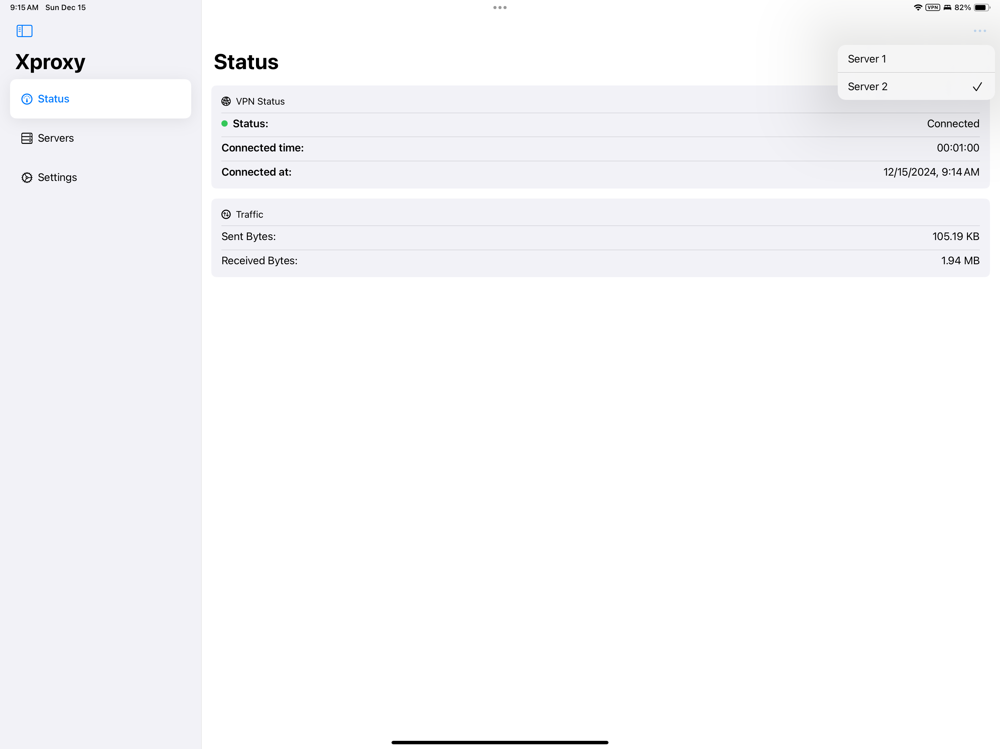
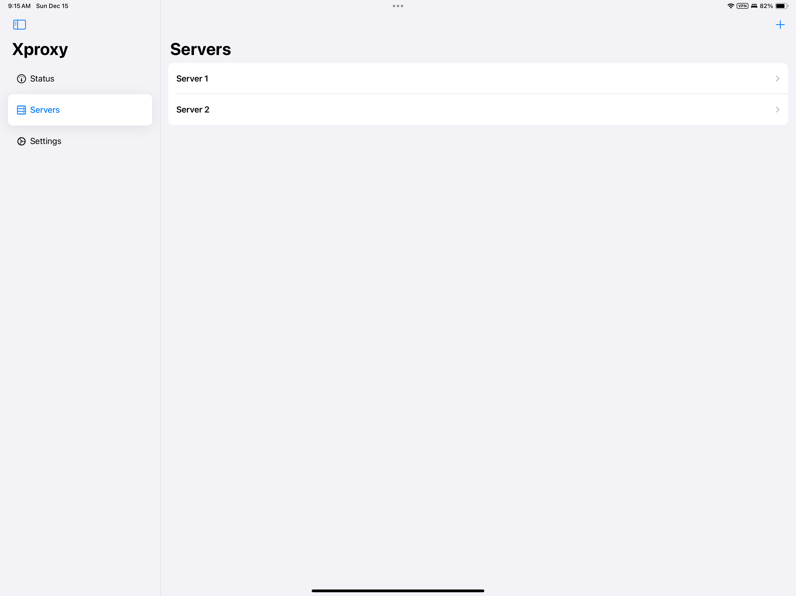
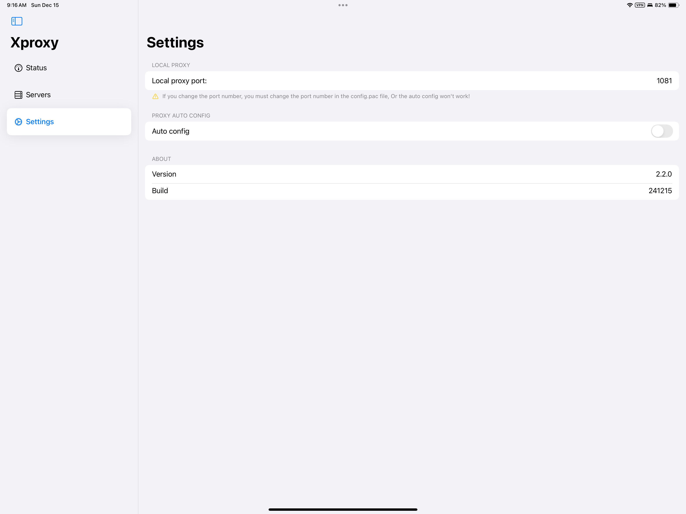
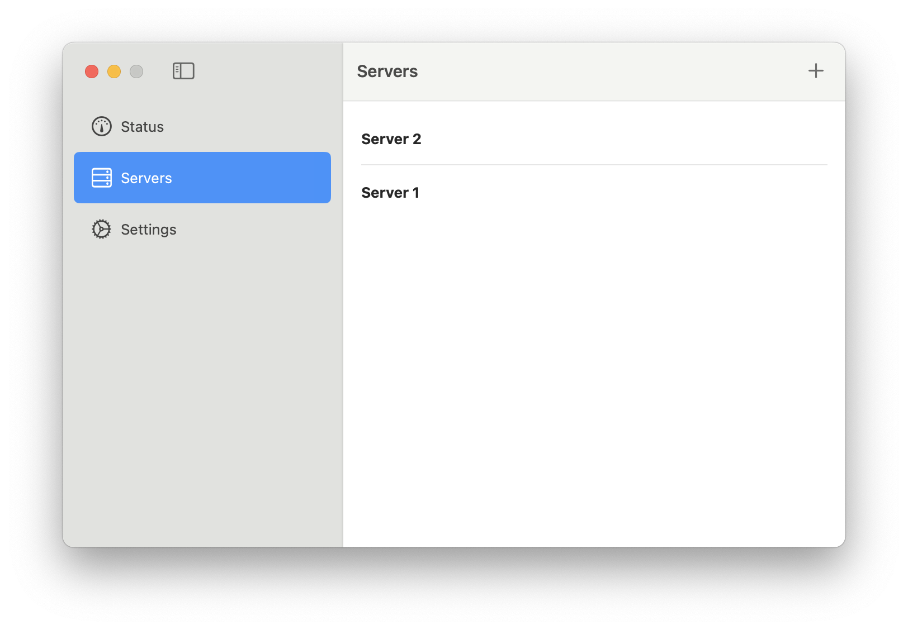
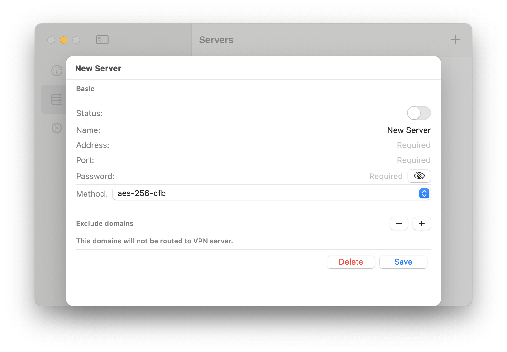
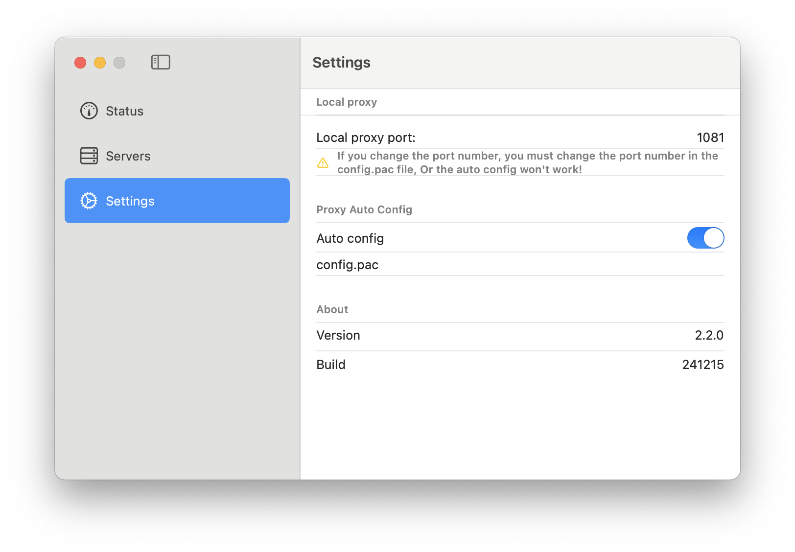

Welcome to XproxyApp
====================

The XproxyApp is a client for Xproxy on iOS and macOS, and Xproxy is a user-space VPN.
The Xproxy dir in this repo is different with the Xproxy (see https://github.com/lampmanyao/xproxy),
the former is a http/https proxy, the later is a SOCKS5 proxy.

ScreenShots
-----------
on iPhone

on iPad

on Mac

System Requirements
-------------------
iOS 16.0 or later
macOS 14.0 or later

HOW IT WORKS
------------

NetworkExtension on iOS doesn't provide proxy settings for socks, but it has two kinds of
proxy settings: http and https. We can setup http and https proxy settings in startTunnel()
of NEPacketTunnelProvider like this:

        var localProxyAddres = "127.0.0.1"
        var localProxyPort = 8080

        let networkSettings = NEPacketTunnelNetworkSettings(tunnelRemoteAddress: "10.0.0.1")
        networkSettings.mtu = 1500

        let ipv4Settings = NEIPv4Settings(addresses: ["10.0.0.2"], subnetMasks: ["255.255.255.0"])
        let proxySettings = NEProxySettings()

        // set the http proxy
        proxySettings.httpEnabled = true
        proxySettings.httpServer = NEProxyServer(address: localProxyAddress, port: localProxyPort)

        // set the https proxy
        proxySettings.httpsEnabled = true
        proxySettings.httpsServer = NEProxyServer(address: localProxyAddress, port: localProxyPort)

        proxySettings.matchDomains = [""]
        // exception list
        proxySettings.exceptionList = exceptionList

        networkSettings.proxySettings = proxySettings
        networkSettings.ipv4Settings = ipv4Settings

        setTunnelNetworkSettings(networkSettings) { error in
            guard error == nil else {
                completionHandler(error)
                return
            }

            if (start_local_proxy() == 0) {
                completionHandler(nil)
            } else {
                completionHandler(nil)
            }
        }

start_local_proxy() will run a local http/https proxy server (local-proxy) which is listening on the localProxyPort,
the system will redirect all the http and https traffics except the domains in the exceptionList to the local-proxy.

  ┌ ─ ─ ─ ┐     0. http request    ┌ ─ ─ ─ ─ ─ ─ ─ ┐                          ┌ ─ ─ ─ ─ ─ ─ ─ ┐                ┌ ─ ─ ─ ─ ─ ┐
  |       |"GET http://example.com/|  local-proxy  |1. SOCKS5 CONNECT request |  remote-proxy | 2. open a tcp  |           |
  │       │        http/1.1"       │┌─────┐ ┌─────┐├ ─ ─ ─ ─ ─ ─ ─ ─ ─ ─ ─ ─ >│┌─────┐ ┌─────┐├ ─ ─ ─ ─ ─ ─ ─ >│           │
  |       |─ ─ ─ ─ ─ ─ ─ ─ ─ ─ ─ ─>|│     │ │     │|                          |│     │ │     │|                |           |
  │       │                        ││     │ │     ││3. SOCKS5 CONNECT response││     │ │     ││                │           │
  |  app  |                        |│ tcp │ │ tcp │|<─ ─ ─ ─ ─ ─ ─ ─ ─ ─ ─ ─ ─|│ tcp │ │ tcp │|                |example.com|
  │       │                        ││     │ │     ││                          ││     │ │     ││blinded exchange│           │
  |       | blinded exchange data  |│     │ │     │|  blinded exchange data   |│     │ │     │|      data      |           |
  │       │< ─ ─ ─ ─ ─ ─ ─ ─ ─ ─ ─>│└─────┘ └─────┘│< ─ ─ ─ ─ ─ ─ ─ ─ ─ ─ ─ ─>│└─────┘ └─────┘│< ─ ─ ─ ─ ─ ─ ─>│           │
  └ ─ ─ ─ ┘                        └ ─ ─ ─ ─ ─ ─ ─ ┘                          └ ─ ─ ─ ─ ─ ─ ─ ┘                └ ─ ─ ─ ─ ─ ┘

Handle request
--------------

The crucial part of the local-proxy is turn the http/https request into a handshake packet communicate with the remote-proxy,
of course, the handshake packet could be any coustom packet, the handshake packet of Xproxy is taken from SOCKS5 - the SOCKS5 CONNECT request.

The request looks like 'GET http://example.com[:port]/ http/1.1' is the http request,
the request looks like 'CONNECT example.com:443 http/1.1' is the https request.

1. the local-proxy extracts the domain and the port from the request line, and sends it to the remote-proxy as a SOCKS5 CONNECT request
2. the remote-proxy opens a tcp connection to example.com:80
3. the remote-proxy replies a SOCKS5 CONNECT response to the local-proxy
4. a) the local-proxy forwards the request to the remote-proxy if the request is http request;
   b) the local-proxy replies a 'HTTP/1.1 200 Connection Established' response to the app if the request is https request
5. exchange data blindly

Each packet between the local-proxy and the remote-proxy is as below:
┌─ ─ ─ ─ ─ ─ ─ ─ ─ ─ ─ ─ + ─ ─ ─ ─ ─ ─ ─ ─ ─ ─ ─ ~ ~ ~ ─ ─┐
|encrypted payload length| encrypted payload     ......   |
└─ ─ ─ ─ ─ ─ ─ ─ ─ ─ ─ ─ + ─ ─ ─ ─ ─ ─ ─ ─ ─ ─ ─ ~ ~ ~ ─ ─┘
the payload length is a 4-byte unsigned integer, following a payload length data.

Dependency
----------
On Linux or macOS:
- libssl-dev

OpenSSL-3.2.0 is precompiled as static library at openssl/lib, iOS and macOS (Intel and Apple Sillicon).

Compilation
-----------

1. % cd Xproxy
2. % autoreconf --install
3. % ./configure --with-openssl-include-path=-I/opt/homebrew/include --with-openssl-static-lib-path=/opt/homebrew/lib
4. % make

local-proxy
-----------

Runing on Linux or macOS:
% ./local-proxy -c ./local.conf

remote-proxy
------------

Runing on Linux or macOS:
% ./remote-proxy -c ./remote.conf

TODOs
-----

- udp proxy
- more secure cipher-suit

